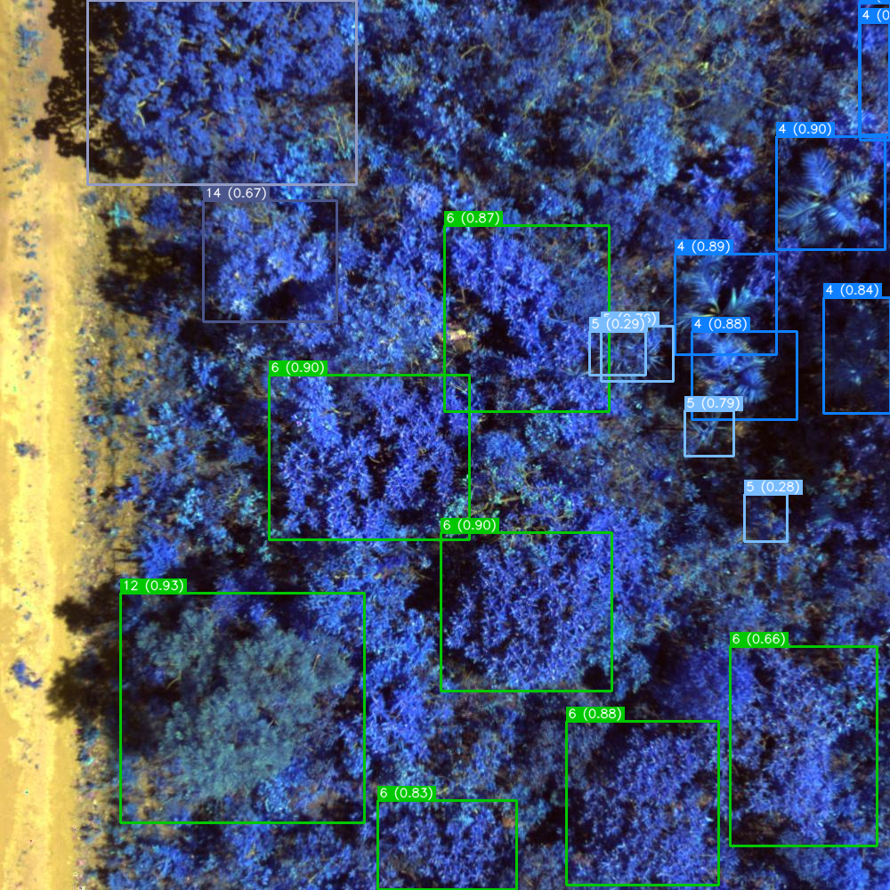
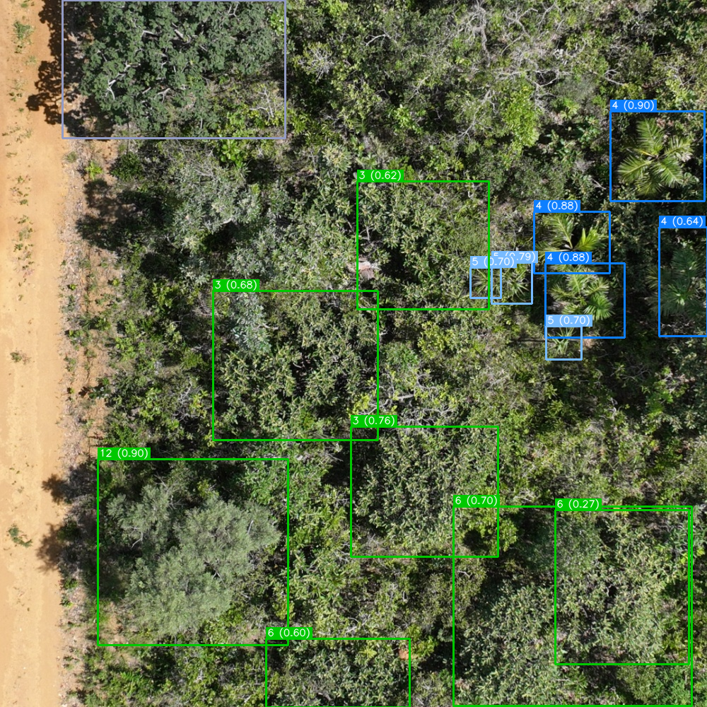
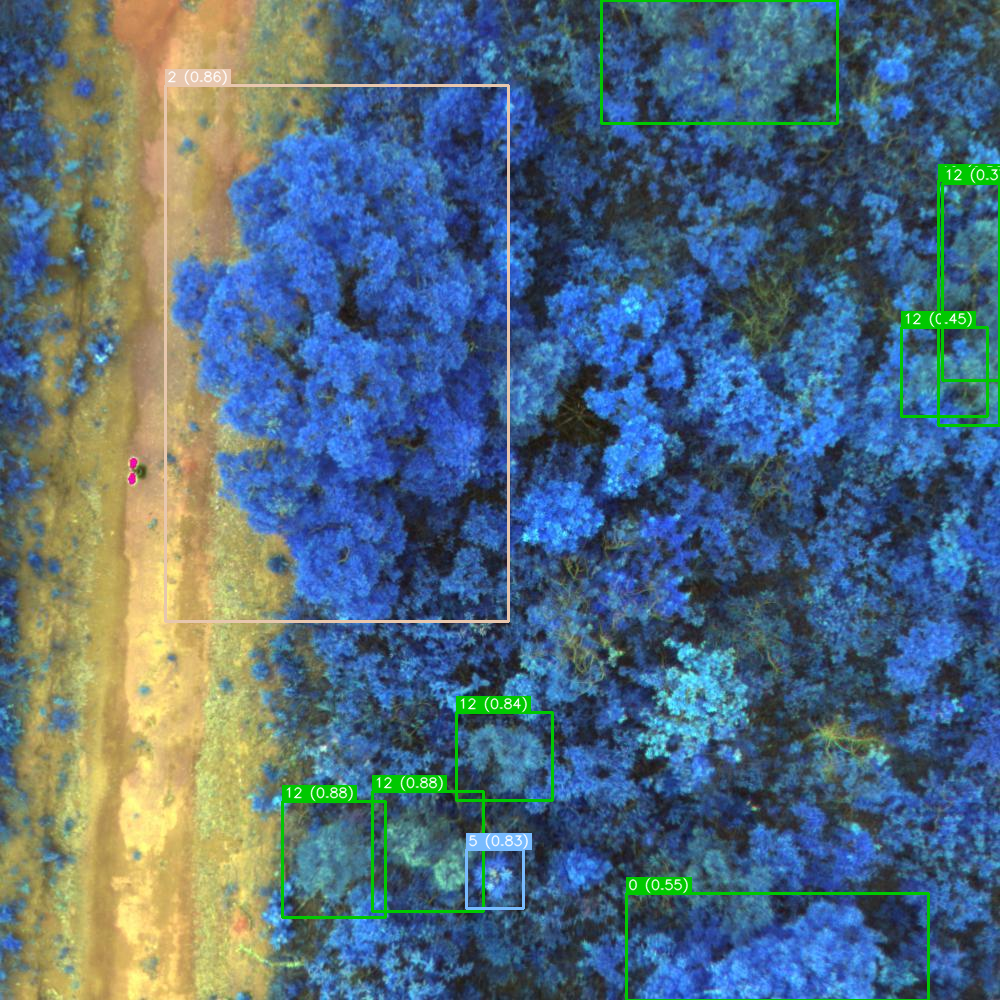
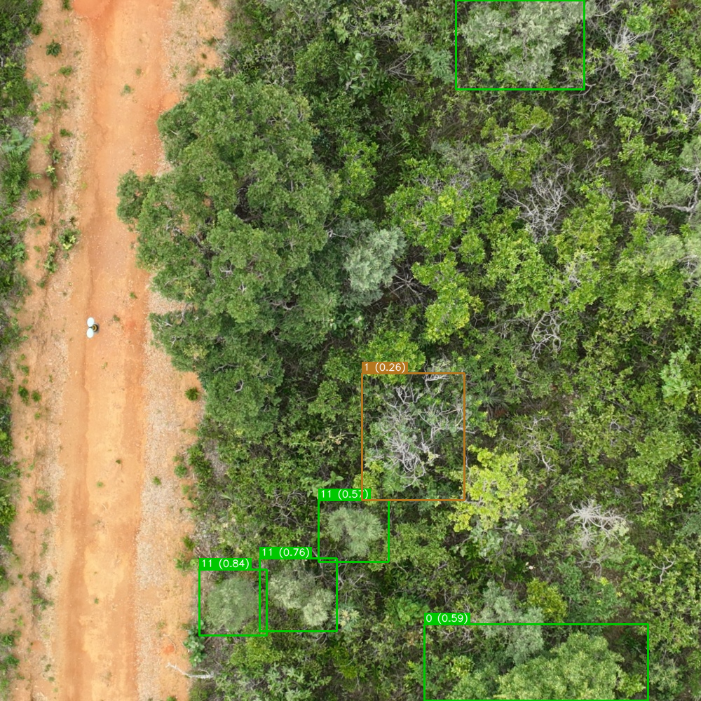

# Cerrado Tree Species Detection via Multispectral UAV Imagery

<!-- This repository contains the code, models, and dataset for the paper:

> **"[Paper Title]"**  
> [Authors] — [Conference/Journal, Year] -->

<!-- ---

## Overview -->

The Brazilian Cerrado is one of the world's most biodiverse and threatened savannas, yet scalable tools for identifying native tree species at the individual level remain scarce. This work presents the **first deep learning benchmark** for this task, introducing:

- A curated dataset of **1,620 UAV multispectral images** covering **16 native Cerrado species**, fully annotated by field biologists at the IBGE Ecological Reserve.
- A **Gram-Schmidt fusion pipeline** that condenses RGB, Red Edge, and NIR bands into a pseudo-RGB representation, enabling unmodified object detectors to exploit near-infrared information.
- A benchmark of **8 detection models** evaluated across **4 image modalities** (Fused, RGB, NDRE, NDVI).

The fused modality consistently outperformed all others, with RT-DETR-L and YOLOv5s achieving **85.2% mAP@50**. Per-species analysis revealed that near-infrared reflectance is critical for rare and morphologically ambiguous taxa, yielding gains exceeding **70 percentage points** over RGB-only inputs for several species.

---

## Dataset

The dataset will be made publicly available upon paper acceptance. It contains:

- 1,620 UAV multispectral images across train, validation, and test splits
- 16 native Cerrado tree species
- Four image modalities: Fused (Gram-Schmidt), RGB, NDRE, NDVI
- Annotations in YOLO format, produced by field biologists

---

## Repository Structure

```
├── src/
│   ├── preprocessing/       # Image preprocessing pipeline
│   ├── image_fusion/        # Gram-Schmidt fusion
│   ├── vegetation_index/    # NDRE and NDVI generation
│   └── models/              # Training and evaluation scripts
├── reports/                 # Evaluation outputs
├── runs/                    # Training artifacts
└── requirements.txt
```

---

## Setup

### Requirements

- Python 3.9+
- CUDA-compatible GPU (recommended)
- `exiftool` for metadata extraction

### Installation

```bash
# Install exiftool
sudo apt update && sudo apt install libimage-exiftool-perl

# Create and activate virtual environment
python -m venv .venv
source .venv/bin/activate

# Install Python dependencies
pip install -r requirements.txt
```

---

## Pipeline

### Step 1 — Preprocess images

```bash
python src/preprocessing/main.py
```

### Step 2 — Fuse multispectral channels (Gram-Schmidt)

```bash
python src/image_fusion/main.py
```

### Step 3 — Generate vegetation indices

```bash
python src/vegetation_index/main.py
```

This generates NDRE, NDVI, and combined modalities (fused-ndre, fused-ndvi, rgb-ndre, rgb-ndvi).

### Step 4 — Train models

```bash
cd src/models/{model_name}/train
bash train.sh
```

Training artifacts are saved to `runs/{model_name}/{image_type}/`.

### Step 5 — Evaluate models

```bash
cd src/models/{model_name}/eval
bash eval.sh
```

Evaluation reports are saved to `reports/{model_name}/`.

---

## Results

| Modality | YOLOv5n | YOLOv5s | YOLOv8n | YOLOv8s | YOLO11n | YOLO11s | RT-DETR-L |
|----------|---------|---------|---------|---------|---------|---------|-----------|
| **Fused** | **76.7** | **85.2** | **80.0** | **83.8** | **81.3** | **84.8** | **85.2** |
| RGB      | 62.3    | 66.8    | 64.8    | 62.2    | 63.8    | 77.4    | 46.2      |
| NDRE     | 49.9    | 59.0    | 54.2    | 59.3    | 49.5    | 58.6    | 51.7      |
| NDVI     | 55.8    | 63.7    | 46.0    | 64.0    | 59.2    | 59.0    | 46.9      |

*mAP@50 (%), mean over 3 seeds. All models trained from scratch.*

---

## Qualitative Results

Detection examples from the test set (RT-DETR-L). Comparing Fused vs. RGB modalities across two different examples.

| (a) Fused | (b) RGB | (c) Fused | (d) RGB |
| :---: | :---: | :---: | :---: |
|  |  |  |  |
---

## License

This project is released under the MIT License. The dataset is released under CC BY 4.0.

<!-- --- -->
<!-- 
## Citation

```bibtex
@article{[key],
  title   = {[Title]},
  author  = {[Authors]},
  journal = {[Venue]},
  year    = {[Year]}
}
``` -->